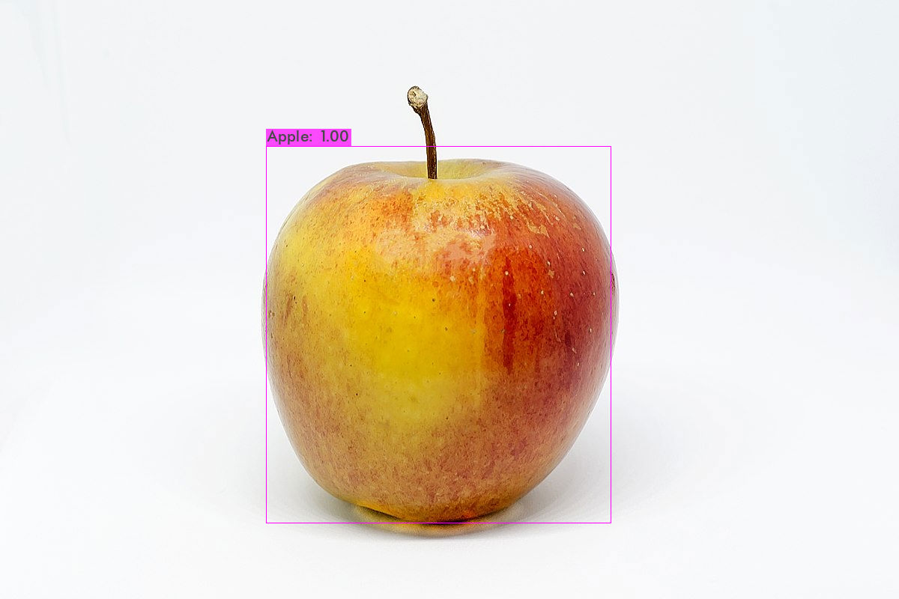

# Train_YOLOv4_With_OpenImageV6_Colab
透過 Google Colab 運行 YOLOv4，並使用 OpenImage  V6 的數據集進行遷移式學習，訓練客製化的YOLO模型。

---

## 介紹
|   程式  |   功能    |
|   ---        |    ---    |
|   [yolov4_darknet.ipynb](yolov4_darknet.ipynb)  |   如何在Colab上安裝darknet並運行YOLOv4
|   [download_open_image.ipynb](download_open_image.ipynb)  |   如何透過工具下載OpenImageV6 數據集  |
|   [train_darknet_with_openimage.ipynb](train_darknet_with_openimage.ipynb)    | 使用 OpenImage數據集訓練 YOLOv4
|   [train_darknet_tiny_with_openimage.ipynb](train_darknet_tiny_with_openimage.ipynb)    | 使用 OpenImage數據集訓練 YOLOv4-tiny

## 圖文教學

<table>
    <tr>
        <td>編號</td>
        <td>標題</td>
    </tr>
    <tr>
        <td>00</td>
        <td><a href='https://docs.google.com/presentation/d/1P3F1mvRdRu8Q0-Ai_mOfnliDgs3ytcGDL69qvh-pWos/edit?usp=sharing'>教學投影片</td>
    </tr>
    <tr>
        <td>01</td>
        <td>
             
             
            <ol>
                <li>YOLOv4訓練其他數據集的基本概念</li>
                <li>如何在Colab上使用YOLOv4</li>
            </ol>
        </td>
    </tr>
    <tr>
        <td>02</td>
        <td>
            <a href=''>下篇尚待發布</a>
             
            <ol>
                <li>找尋欲訓練的數據集
                <li>使用特定數據集進行Transfer Learning
                <li>於Colab上進行測試
                <li>下載至Jetson Nano並進行測試
                <li>補充-如何讓訓練更好?
            </ol>
        </td>
    </tr>
</table>

## 補充

* [Train Yolov5 with custom data](https://github.com/p513817/YOLOv5_RoadCondition_TransferLearning_JetsonNano)

* [Friendiest YOLOv4 python sample](https://github.com/p513817/Friendiest_YOLOv4_Sample)

